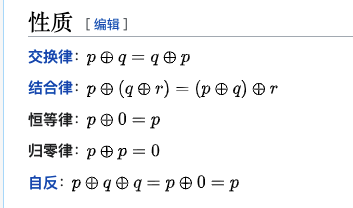

# 异或运算的性质：
异或运算是基于二进制的位运算，采用符号XOR或者^来表示，运算规则是就与二进制，如果是同值取0、异值取1。

简单的理解就是不进位加法，例如1+1=0，0+0=0，1+0=1；

性质：

交换律 可以任意交换运算因子，结果不变。
结合律 （a^b）^c=a^(a^c)
对于任何数x，都有x^x=0,x^0=x,同自己求异或运算为0，同0求异或运算结果为自己
自反性，A^B^B=A^0=A。这个性质可以用来求哪一个数为一个

[两数交换](../Change.java)  
[判断奇偶](../OddOrEven.java)  
[查找重复数](../FindPair.java)  
[查找落单数](../FindAlone.java)  
[查找两个落单数](../FindTwoAlone.java)
[找连续自然数中跑丢的两个数](../FindTwoRunAway.java)
[找连续自然数中跑丢的三个数](../FindThreeAlone.java)  